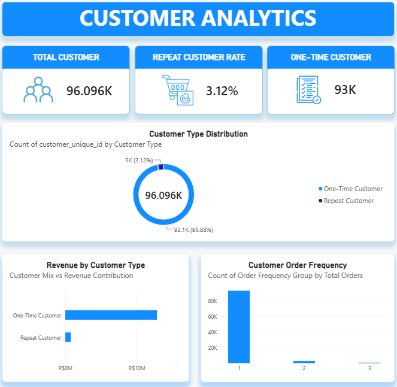

# Olist E-Commerce Sales & Customer Analytics

## 📌 Overview

This project analyzes the Brazilian E-Commerce Public Dataset
by Olist to evaluate sales performance, customer behavior,
delivery performance, and customer satisfaction.

The project simulates a Data Analyst Intern assignment
in an e-commerce company.

---

## 🎯 Business Objective

The objective is to transform transactional data into
actionable business insights that can support decisions
related to sales, customer retention, and delivery performance.

---

## ❓ Business Questions

1. How is sales performance changing over time?
2. Which product categories generate the most revenue?
3. How strong is customer retention?
4. Which sellers or regions have delivery issues?
5. Is delivery delay associated with customer satisfaction?

---

## 🗂️ Dataset

Brazilian E-Commerce Public Dataset by Olist

Source:
https://www.kaggle.com/olistbr/brazilian-ecommerce

The dataset contains approximately 100,000 orders
from 2016–2018.

---

## 🛠️ Tools

- PostgreSQL
- SQL
- Power BI
- DAX
- Git/GitHub

---

## 🔄 Analytical Workflow

Raw Data
→ Data Quality Check
→ SQL Cleaning
→ SQL Analysis
→ Data Modeling
→ DAX
→ Power BI Dashboard
→ Business Insights
→ Recommendations

---

## 📊 Dashboard

### Executive Overview


### Customer Analytics



### Delivery & Satisfaction


---

## 📈 KPIs

- Total Revenue
- Total Orders
- Total Customers
- Average Order Value
- Repeat Customer Rate
- Late Delivery Rate
- Average Review Score

---

## 🔎 Key Insights

### Sales Performance

[Insert validated finding]

### Customer Behavior

[Insert validated finding]

### Delivery Performance

[Insert validated finding]

### Customer Satisfaction

[Insert validated finding]

---

## 💡 Business Recommendations

### 1. Delivery Improvement

[Insert recommendation]

### 2. Customer Retention

[Insert recommendation]

### 3. Product Strategy

[Insert recommendation]

---

## 📁 Repository Structure

```text
sql/
powerbi/
docs/
data/
README.md
