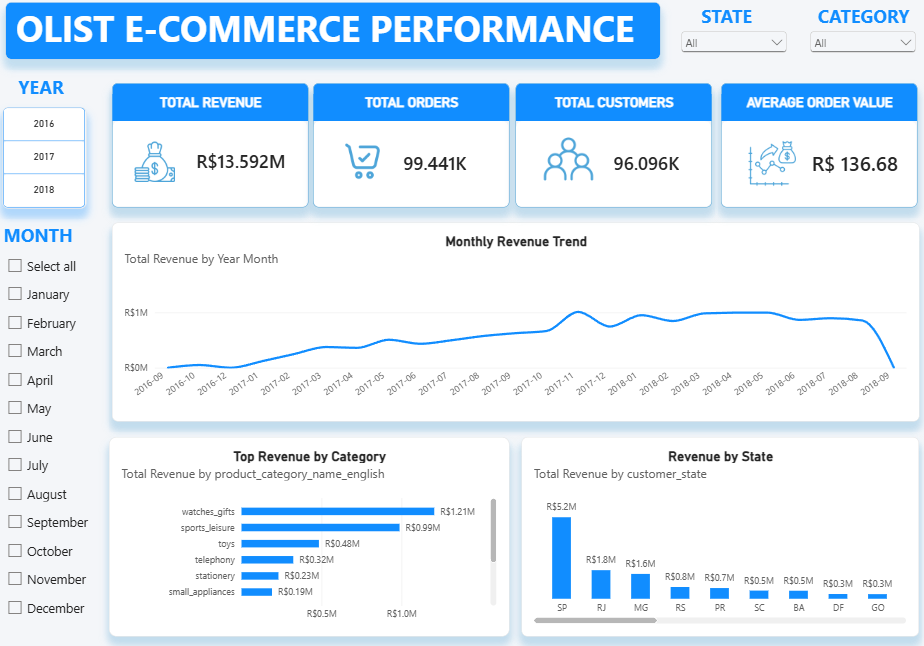
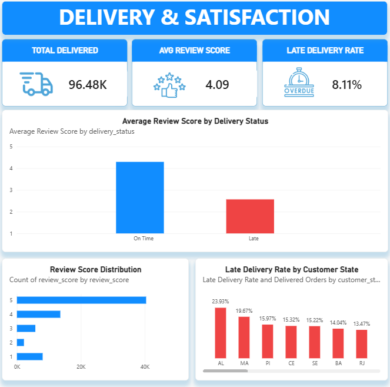

# Olist E-Commerce Business Performance & Customer Analytics

> **Proyek Data Analytics End-to-End** yang menganalisis kinerja bisnis e-commerce, perilaku pelanggan, kategori produk, kinerja seller, operasional pengiriman, dan kepuasan pelanggan menggunakan **PostgreSQL, SQL, Power BI, dan DAX**.

---

## Project Overview

Proyek ini menganalisis **Brazilian E-Commerce Public Dataset by Olist**, yang mencakup sekitar **99K orders pada periode 2016–2018**.

Tujuan proyek ini adalah mengubah data e-commerce mentah menjadi insight bisnis yang dapat ditindaklanjuti pada beberapa area utama:

* Revenue dan order performance
* Customer retention dan purchase frequency
* Customer revenue concentration
* Product category performance
* Seller performance
* Delivery performance
* Customer satisfaction
* Geographic delivery performance

Proyek ini mengikuti alur kerja **end-to-end data analytics**, dimulai dari data validation dan cleaning menggunakan PostgreSQL, dilanjutkan dengan business analysis berbasis SQL, kemudian pengembangan dashboard interaktif menggunakan Power BI.

---

## Pertanyaan Bisnis

Analisis ini dirancang untuk menjawab beberapa pertanyaan bisnis berikut:

1. Bagaimana perubahan revenue dan order performance dari waktu ke waktu?
2. Kategori produk mana yang memberikan kontribusi terbesar terhadap revenue dan order volume?
3. Seberapa signifikan keberadaan repeat customers?
4. Seberapa terkonsentrasi revenue pada high-value customers?
5. Seller mana yang memberikan kontribusi signifikan terhadap revenue dan order volume?
6. Seberapa baik platform dalam hal delivery performance?
7. Apakah delivery performance memiliki hubungan dengan customer review scores?
8. Bagaimana delivery performance berbeda di berbagai negara bagian di Brazil?

---

## Dataset

**Dataset:** Brazilian E-Commerce Public Dataset by Olist

Dataset ini berisi informasi yang berkaitan dengan:

* Customers
* Orders
* Order items
* Products
* Sellers
* Payments
* Reviews
* Product category translations

Dataset mencakup sekitar **100K orders antara tahun 2016 dan 2018**.

### Main Tables

| Table                               | Description                                  |
| ----------------------------------- | -------------------------------------------- |
| `customers`                         | Informasi customer dan lokasi                |
| `orders`                            | Informasi order dan timestamps               |
| `order_items`                       | Produk yang dibeli dalam setiap order        |
| `products`                          | Informasi produk dan kategori                |
| `sellers`                           | Informasi seller dan lokasi                  |
| `order_payments`                    | Informasi pembayaran                         |
| `order_reviews`                     | Customer review scores                       |
| `product_category_name_translation` | Pemetaan kategori dari Portuguese ke English |

### Important Data Grain Consideration

`orders` dan `order_items` memiliki hubungan **one-to-many**.

Oleh karena itu, metrik pada tingkat order seperti:

* Total Orders
* Customer Orders
* Delivery Status

harus menggunakan **distinct order counting** ketika digabungkan dengan `order_items`.

Contoh:

```sql
COUNT(DISTINCT order_id)
```

Hal ini mencegah terjadinya duplikasi order selama proses analisis.

---

## Data Preparation & Validation

Data preparation dan validation dilakukan menggunakan **PostgreSQL**.

### Timestamp Cleaning

Beberapa timestamp fields pada awalnya disimpan sebagai text values dan mengandung empty strings.

Empty strings ditangani menggunakan:

```sql
NULLIF(column_name, '')::TIMESTAMP
```

Pendekatan ini mempertahankan missing values sebagai `NULL`, yang penting untuk order yang belum selesai dikirim.

### Delivery Status

Order diklasifikasikan ke dalam tiga delivery statuses:

| Status          | Definition                                          |
| --------------- | --------------------------------------------------- |
| `On Time`       | Delivered pada atau sebelum estimated delivery date |
| `Late`          | Delivered setelah estimated delivery date           |

Sebuah order dianggap `Late` ketika:

```text
Delivered Date > Estimated Delivery Date
```

### Category Validation

English product category tidak disimpan secara langsung di dalam tabel `products`.

Category mapping mengikuti alur:

```text
products.product_category_name
            ↓
product_category_name_translation.product_category_name
            ↓
product_category_name_english
```

Translation table juga diperiksa untuk memastikan tidak terdapat duplicate category keys.

**Hasil:** Tidak ditemukan duplicate translation keys.

Beberapa produk memiliki category yang kosong, missing, atau tidak memiliki English translation. Record tersebut diklasifikasikan sebagai:

```text
Unknown / Untranslated
```

Sekitar **98.64% product revenue** dapat dipetakan ke translated categories.

---

## Key Metrics

| Metric               |        Result |
| -------------------- | ------------: |
| Unique Customers     |    **96,096** |
| Total Orders         |    **99,441** |
| Orders with Items    |    **98,666** |
| Product Revenue      | **~R$13.60M** |
| Average Order Value  |  **R$137.74** |
| Repeat Customer Rate |     **3.12%** |
| Late Delivery Rate   |     **8.11%** |
| Average Review Score |     **~4.09** |

### Revenue Definition

Product revenue dihitung menggunakan:

```text
order_items.price
```

`freight_value` tidak termasuk dalam revenue metric.

### Average Order Value (AOV)

AOV dihitung menggunakan formula:

```text
Product Revenue
────────────────────
Orders with Items
```

Hasil:

```text
R$137.74
```

---

# Power BI Dashboard

Power BI dashboard terdiri dari **tiga analytical pages**, yang masing-masing dirancang berdasarkan perspektif bisnis tertentu.

---

## 1. Executive Overview



**Executive Overview** memberikan gambaran tingkat tinggi mengenai keseluruhan business performance.

### KPIs

* Total Revenue
* Total Orders
* Total Customers
* Average Order Value

### Visualizations

* Monthly Revenue Trend
* Revenue by Product Category
* Revenue by State

### Business Question

> **Bagaimana performa bisnis secara keseluruhan?**

---

## 2. Customer Analytics


Halaman **Customer Analytics** berfokus pada customer behavior dan revenue contribution.

### KPIs

* Total Customers
* Repeat Customers
* One Time Customer

### Visualizations

* One-Time vs Repeat Customers
* Customer Order Frequency
* Revenue by Customer Type

### Business Question

> **Siapa customer perusahaan dan bagaimana pola pembelian mereka?**

---

## 3. Delivery & Satisfaction



Halaman **Delivery & Satisfaction** menganalisis logistics performance dan customer experience.

### KPIs

* Total Delivered
* Late Delivery Rate
* Average Review Score

### Visualizations

* Review Score by Delivery Status
* Review Score Distribution
* Late Delivery Rate by State

### Business Question

> **Bagaimana delivery performance berkaitan dengan customer satisfaction?**

---

# Key Findings

## 1. Revenue Mengalami Pertumbuhan yang Kuat Selama 2017

Monthly revenue mengalami peningkatan yang cukup besar sepanjang tahun 2017.

**November 2017** mencatat sekitar:

> ### R$1.01M

dengan:

* **7,451 orders**
* Sekitar **52.10% month-over-month revenue growth** dibandingkan Oktober 2017

Revenue kemudian mengalami fluktuasi selama 2018, tetapi tetap berada pada level yang relatif tinggi hingga Agustus.

---

## 2. Repeat Customers Merupakan Sebagian Kecil dari Customer Base

Hanya:

> ### 3.12%

dari unique customers yang diklasifikasikan sebagai repeat customers.

Namun, repeat customers menghasilkan revenue per customer yang lebih tinggi:

| Customer Type | Customers | Revenue / Customer |
| ------------- | --------: | -----------------: |
| One-Time      |    93,099 |           R$137.66 |
| Repeat        |     2,997 |           R$259.87 |

Hal ini menunjukkan bahwa **customer purchase frequency merupakan salah satu dimensi penting untuk analisis customer lebih lanjut**.

---

## 3. Revenue Terkonsentrasi pada High-Value Customers

Top **10% of customers**, berdasarkan product revenue, memberikan kontribusi:

> ### 41.23% of Total Product Revenue

Hal ini menunjukkan bahwa kontribusi revenue tidak tersebar secara merata di seluruh customer base.

**Important:** Analisis ini mengukur revenue contribution dan tidak boleh diinterpretasikan secara langsung sebagai ukuran customer loyalty.

---

## 4. Category Performance Berbeda antara Order Volume dan Revenue

Order volume tidak selalu secara langsung mencerminkan revenue contribution.

| Category                | Orders |  Revenue |
| ----------------------- | -----: | -------: |
| `health_beauty`         |  8,836 | R$1.259M |
| `watches_gifts`         |  5,624 | R$1.205M |
| `bed_bath_table`        |  9,417 | R$1.037M |
| `sports_leisure`        |  7,720 |   R$988K |
| `computers_accessories` |  6,689 |   R$912K |

Sebagai contoh, `bed_bath_table` menghasilkan order yang lebih banyak dibandingkan `health_beauty`, sedangkan `health_beauty` menghasilkan product revenue yang lebih tinggi.

Hal ini menunjukkan bahwa category performance sebaiknya dievaluasi menggunakan **transaction volume dan monetary contribution secara bersamaan**.

---

## 5. Late Delivery Rate Sebesar 8.11% di antara Delivered Orders

Secara keseluruhan, delivery performance adalah:

| Status        | Orders |  Share |
| ------------- | -----: | -----: |
| On Time       | 88,649 | 89.15% |
| Late          |  7,827 |  7.87% |

Late delivery rate di antara **delivered orders** adalah:

> ### 8.11%

---

## 6. Late Deliveries Berkaitan dengan Review Scores yang Lebih Rendah

Average review scores berbeda antara late dan on-time deliveries:

| Delivery Status | Reviewed Orders | Average Review |
| --------------- | --------------: | -------------: |
| Late            |           5,395 |           2.57 |
| On Time         |          62,371 |           4.29 |

Perbedaannya adalah:

> ### 1.72 Review Points

Hal ini menunjukkan adanya **association antara delivery status dan customer review scores** pada data yang diamati.

>  **Important:** Analisis ini **tidak membuktikan hubungan kausalitas**. Hubungan yang diamati tidak membuktikan bahwa late delivery secara langsung menyebabkan review scores yang lebih rendah.

---

## 7. Delivery Performance Berbeda di Berbagai States

Late delivery rates menunjukkan variasi yang cukup besar di berbagai Brazilian states.

| State | Delivered Orders | Late Orders | Late Rate |
| ----- | ---------------: | ----------: | --------: |
| CE    |            1,279 |         196 |    15.32% |
| BA    |            3,256 |         457 |    14.04% |
| RJ    |           12,353 |       1,664 |    13.47% |
| SP    |           40,495 |       2,387 |     5.89% |
| MG    |           11,355 |         638 |     5.62% |
| PR    |            4,923 |         246 |     5.00% |

Baik **delivery rate maupun order volume** perlu dipertimbangkan ketika menginterpretasikan geographic delivery performance.

---

# Potential Business Actions

Pola yang ditemukan menunjukkan beberapa area yang dapat dianalisis lebih lanjut.

### 1. Customer Retention

Customer dapat disegmentasikan lebih lanjut berdasarkan:

* Purchase frequency
* Revenue
* Recency
* Category preference

Hal ini dapat mendukung analisis retention dan engagement yang lebih targeted.

### 2. High-Value Customer Analysis

High-revenue customers dapat dimonitor berdasarkan:

* Revenue contribution
* Purchase frequency
* Category preference
* Changes in purchasing behavior

### 3. Category Strategy

Kategori dapat dievaluasi menggunakan beberapa dimensi:

* Order volume
* Revenue
* Revenue share
* Revenue per order

### 4. Delivery Performance

Late delivery patterns dapat dianalisis lebih lanjut berdasarkan:

* State
* Seller
* Order characteristics
* Delivery duration

### 5. Customer Experience

Delivery KPIs dapat dikombinasikan dengan review metrics untuk memonitor potential relationships antara **logistics performance dan customer satisfaction**.

---

# Limitations

Beberapa keterbatasan perlu dipertimbangkan ketika menginterpretasikan hasil analisis.

### Historical Dataset

Dataset mencakup periode sekitar **2016–2018**, sehingga tidak merepresentasikan kondisi e-commerce saat ini.

### Revenue Definition

Revenue dihitung menggunakan:

```text
order_items.price
```

dan tidak mencakup:

```text
freight_value
```

### No Cost Data

Dataset tidak menyediakan informasi biaya yang memadai untuk menghitung:

* Profit
* Profit margin

Oleh karena itu, kategori atau seller dengan revenue tinggi **tidak dapat secara otomatis diinterpretasikan sebagai kategori atau seller yang paling profitable**.

### Review Data

Review analysis hanya mencakup order yang memiliki available reviews.

Oleh karena itu, hasil analisis review mungkin tidak merepresentasikan seluruh order.

### Correlation vs. Causation

Hubungan antara delivery status dan review score harus diinterpretasikan sebagai **association**, bukan sebagai bukti bahwa late delivery secara langsung menyebabkan review yang lebih rendah.

### Category Mapping

Sebagian kecil product revenue tidak dapat dipetakan ke English product category dan diklasifikasikan sebagai:

```text
Unknown / Untranslated
```

---

# Tools & Technologies

| Technology       | Purpose                                              |
| ---------------- | ---------------------------------------------------- |
| **PostgreSQL**   | Data storage, cleaning, validation, dan SQL analysis |
| **SQL**          | Business analysis dan data transformation            |
| **Power BI**     | Interactive dashboard dan data visualization         |
| **DAX**          | Business metrics dan calculated measures             |
| **Git & GitHub** | Version control dan project documentation            |

---

# Project Structure

```text
olist-ecommerce-business-analytics/
│
├── README.md
│
├── sql/
│   ├── 01_data_validation.sql
│   ├── 02_data_cleaning.sql
│   ├── 03_business_analysis.sql
│   └── 04_advanced_analysis.sql
│
├── powerbi/
│   └── Olist_Ecommerce_Analytics.pbix
│
├── images/
│   ├── executive_overview.png
│   ├── customer_analytics.png
│   └── delivery_satisfaction.png
│
└── data/
    └── README.md
```

---

# Future Improvements

Pengembangan lebih lanjut yang dapat dilakukan pada proyek ini meliputi:

* Customer RFM segmentation
* Customer cohort analysis
* Customer lifetime value analysis
* Seller performance segmentation
* Delivery time analysis
* Category-level customer segmentation
* Pareto analysis of revenue contribution
* Statistical analysis of delivery and review scores
* Predictive modeling for repeat purchases
* Predictive delivery delay analysis

---

# Author

**Fathur Rahman Rifaldi**

Information Systems Student

Interested in:

* Data Analytics
* Business Intelligence
* Machine Learning
* Information Systems

---

## Disclaimer

Proyek ini dibuat untuk **educational dan portfolio purposes**.

Business recommendations yang disampaikan merupakan potential areas untuk investigasi lebih lanjut berdasarkan dataset yang tersedia dan tidak boleh diinterpretasikan sebagai confirmed causal conclusions.
