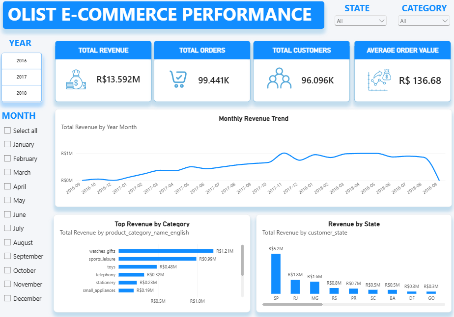

# Olist E-Commerce Sales Performance Analysis
> Analisis performa penjualan e-commerce menggunakan **PostgreSQL, SQL, Power BI, dan DAX** untuk memantau revenue, order performance, kategori produk, dan distribusi penjualan berdasarkan wilayah.
---
## Project Overview
Proyek ini menggunakan **Brazilian E-Commerce Public Dataset by Olist**, yang mencakup sekitar **99 ribu orders pada periode 2016–2018**.
Fokus proyek adalah membuat analisis penjualan yang ringkas dan dashboard **Executive Overview** untuk menjawab pertanyaan bisnis dasar: bagaimana performa penjualan, bagaimana tren revenue berubah dari waktu ke waktu, dan kategori produk serta wilayah mana yang memberikan kontribusi revenue terbesar.
Alur kerja proyek mencakup data validation dan preparation menggunakan PostgreSQL, analisis bisnis menggunakan SQL, serta pembuatan dashboard menggunakan Power BI dan DAX.
## Business Context
Bisnis e-commerce perlu memantau indikator penjualan secara konsisten untuk memahami perkembangan revenue, jumlah pesanan, dan kontribusi kategori produk. Data transaksi yang tersebar di beberapa tabel perlu diolah dan dirangkum agar dapat digunakan untuk mengevaluasi performa bisnis.
Dalam proyek ini, saya berperan sebagai Data Analyst yang menggunakan data transaksi historis Olist untuk menyusun ringkasan performa penjualan dalam satu dashboard.
## Problem Statement
Data transaksi yang tersimpan dalam beberapa tabel tidak langsung memberikan gambaran performa penjualan secara menyeluruh. Diperlukan proses validasi, penggabungan, dan agregasi data untuk menghasilkan metrik yang konsisten serta visualisasi yang mudah dipahami.
## Objectives
- Mengukur indikator utama penjualan: product revenue, orders, customers, dan Average Order Value (AOV).
- Memantau tren revenue bulanan.
- Mengidentifikasi kategori produk dengan kontribusi revenue dan volume order tertinggi.
- Membandingkan revenue berdasarkan state pelanggan.
- Menyajikan hasil analisis melalui dashboard Power BI yang ringkas dan interaktif.
## Business Questions
1. Berapa total product revenue, jumlah orders, jumlah customers, dan Average Order Value?
2. Bagaimana tren revenue bulanan sepanjang periode data?
3. Kategori produk mana yang menghasilkan revenue tertinggi?
4. Apakah kategori dengan order volume tertinggi juga memiliki revenue tertinggi?
5. Bagaimana kontribusi revenue berbeda berdasarkan state pelanggan?
## Dataset
**Dataset:** [Brazilian E-Commerce Public Dataset by Olist](https://www.kaggle.com/datasets/olistbr/brazilian-ecommerce)
Dataset mencakup data customer, orders, order items, products, sellers, payments, reviews, serta pemetaan nama kategori produk dari bahasa Portugis ke bahasa Inggris.
### Main Tables
| Table | Purpose |
| --- | --- |
| `customers` | Informasi pelanggan dan lokasi |
| `orders` | Informasi pesanan dan timestamp |
| `order_items` | Produk, harga, freight, dan seller pada setiap pesanan |
| `products` | Informasi produk dan kategori |
| `product_category_name_translation` | Pemetaan kategori Portugis ke bahasa Inggris |
Tabel lain pada dataset dapat digunakan bila dibutuhkan, tetapi analisis utama proyek ini berfokus pada metrik penjualan dan kategori produk.
### Data Grain Consideration
Tabel `orders` dan `order_items` memiliki hubungan **one-to-many**: satu order dapat memiliki beberapa item. Karena itu, saat menghitung jumlah order setelah menggabungkan tabel, digunakan:
```sql
COUNT(DISTINCT order_id)
```
Pendekatan ini membantu mencegah penghitungan order yang sama lebih dari satu kali. Revenue produk dihitung pada grain item dari kolom `order_items.price`.
## Data Preparation & Validation
Data preparation dan validation dilakukan menggunakan PostgreSQL.
### Timestamp Handling
Sebagian timestamp awalnya tersimpan sebagai text dan dapat mengandung empty string. Nilai kosong ditangani sebelum konversi ke timestamp, misalnya:
```sql
NULLIF(column_name, '')::TIMESTAMP
```
Nilai yang tidak tersedia dipertahankan sebagai `NULL` jika memang tidak ada tanggal yang tercatat.
### Category Mapping
Nama kategori bahasa Inggris berada di tabel `product_category_name_translation`, bukan langsung di tabel `products`. Penggabungan kategori dilakukan menggunakan `product_category_name`.
```sql
SELECT
    p.product_id,
    pct.product_category_name_english
FROM products p
LEFT JOIN product_category_name_translation pct
    ON NULLIF(TRIM(p.product_category_name), '') =
    pct.product_category_name;
```
Validasi menunjukkan tidak ada duplicate key pada translation table. Sebagian kecil revenue produk tidak dapat dipetakan ke kategori bahasa Inggris; kategori yang tidak terpetakan sebaiknya tetap dipertahankan sebagai `Unknown / Untranslated`, bukan dibuang dari perhitungan revenue total.
## Key Metrics
| Metric | Result / Definition |
| --- | ---: |
| Unique Customers | **96,096** |
| Total Orders | **99,441** |
| Orders with Items | **98,666** |
| Product Revenue | **Approximately R$13.60M** |
| Average Order Value | **R$137.74** |
### Metric Definitions
**Product Revenue**
Dihitung menggunakan `SUM(order_items.price)`. Nilai `freight_value` tidak termasuk dalam definisi revenue proyek ini.
**Total Orders**
Jumlah order unik menggunakan `COUNT(DISTINCT orders.order_id)`.
**Total Customers**
Jumlah pelanggan unik menggunakan `customer_unique_id`, bukan sekadar menghitung baris pada tabel customers.
**Average Order Value (AOV)**
AOV dihitung sebagai product revenue dibagi jumlah order yang memiliki item:
```text
AOV = Product Revenue / Orders with Items
```
Hasil dashboard: **R$137.74**.
> Catatan: definisi AOV pada proyek ini menggunakan product revenue dan orders with items. Definisi tersebut perlu dipertahankan secara konsisten saat membandingkan angka antara SQL dan Power BI.
## Power BI Dashboard — Executive Overview

Dashboard satu halaman ini memberikan ringkasan performa penjualan e-commerce.
### KPI Cards
- **Total Revenue** — total product revenue berdasarkan `order_items.price`.
- **Total Orders** — jumlah order unik.
- **Total Customers** — jumlah customer unik.
- **Average Order Value** — product revenue dibagi orders with items.
### Visualizations
- **Monthly Revenue Trend** — memantau perubahan revenue per bulan.
- **Revenue by Product Category** — membandingkan kontribusi revenue antar kategori.
- **Revenue by State** — membandingkan revenue berdasarkan state pelanggan.
### Dashboard Objective
> Bagaimana performa penjualan secara keseluruhan, bagaimana trennya berubah dari waktu ke waktu, dan kategori serta wilayah mana yang memberikan kontribusi revenue terbesar?
## Key Findings
### 1. Revenue Mencapai Puncak pada November 2017
November 2017 mencatat sekitar **R$1.01 juta** product revenue, dengan **7,451 orders** dan pertumbuhan revenue sekitar **52.10% dibandingkan Oktober 2017**.
**Business implication:** Periode dengan kenaikan revenue yang signifikan layak ditelusuri lebih lanjut dengan melihat perubahan order volume dan kontribusi kategori produk. Data ini sendiri belum menjelaskan penyebab kenaikan.
### 2. Kategori dengan Revenue Tertinggi Tidak Selalu Memiliki Order Terbanyak
Contoh kategori dengan kontribusi revenue tinggi:
| Product Category | Orders | Approx. Revenue |
| --- | ---: | ---: |
| `health_beauty` | 8,836 | R$1.259M |
| `watches_gifts` | 5,624 | R$1.205M |
| `bed_bath_table` | 9,417 | R$1.037M |
| `sports_leisure` | 7,720 | R$988K |
| `computers_accessories` | 6,689 | R$912K |
`health_beauty` mencatat revenue tertinggi di antara kategori yang ditampilkan, sedangkan `bed_bath_table` memiliki jumlah order tertinggi di antara kategori tersebut.
**Business implication:** Kategori produk sebaiknya dievaluasi berdasarkan revenue dan order volume secara bersamaan. Revenue tinggi tidak otomatis berarti profitabilitas tinggi karena dataset ini tidak menyediakan data biaya yang memadai.
### 3. Dashboard Mendukung Pemantauan Penjualan dari Beberapa Perspektif
KPI cards memberikan ringkasan performa, sementara tren bulanan, kategori produk, dan state membantu pengguna menelusuri perubahan serta perbedaan kontribusi penjualan.
**Business implication:** Dashboard dapat digunakan sebagai titik awal untuk memonitor performa dan mengidentifikasi area yang membutuhkan analisis lebih lanjut.
## Recommendations
Berdasarkan analisis deskriptif ini, beberapa tindak lanjut yang dapat dipertimbangkan adalah:
1. **Investigasi tren revenue:** telusuri periode dengan kenaikan atau penurunan signifikan menggunakan order volume dan kategori produk.
2. **Evaluasi kategori produk:** bandingkan revenue dan jumlah order untuk memahami perbedaan kontribusi antar kategori.
3. **Pantau kontribusi wilayah:** gunakan revenue by state untuk mengidentifikasi perbedaan pola penjualan geografis.
4. **Kembangkan analisis lanjutan bila diperlukan:** misalnya analisis customer atau delivery dapat menjadi proyek terpisah jika ada kebutuhan bisnis dan ruang lingkup yang jelas.
Rekomendasi di atas merupakan area untuk investigasi lebih lanjut, bukan klaim bahwa suatu tindakan pasti meningkatkan revenue.
## Tools & Technologies
| Technology | Purpose |
| --- | --- |
| **PostgreSQL** | Penyimpanan, validasi, dan persiapan data |
| **SQL** | Penggabungan tabel, agregasi, dan analisis bisnis |
| **Power BI** | Dashboard dan visualisasi interaktif |
| **DAX** | Perhitungan KPI dan measures |
| **Git & GitHub** | Version control dan dokumentasi proyek |
## Project Structure
Sesuaikan struktur di bawah ini dengan file yang benar-benar diunggah ke repository.
```text
olist-ecommerce-sales-performance/
├── README.md
├── sql/
│   ├── 01_data_validation.sql
│   ├── 02_data_cleaning.sql
│   └── 03_sales_analysis.sql
├── powerbi/
│   └── Olist_Sales_Performance.pbix
├── images/
│   └── executive_overview.png
└── data/
    └── README.md
```
Jangan mengunggah dataset mentah berukuran besar jika tidak diperlukan. Cukup sertakan tautan sumber dataset dan petunjuk untuk mendapatkannya.
## Limitations
- **Historical data:** dataset mencakup sekitar 2016–2018 dan tidak merepresentasikan kondisi e-commerce saat ini.
- **Revenue definition:** revenue hanya menggunakan `order_items.price` dan tidak mencakup `freight_value`.
- **No cost data:** analisis ini tidak dapat menentukan profit atau profit margin.
- **Category mapping:** sebagian kecil revenue tidak memiliki kategori bahasa Inggris yang dapat dipetakan.
- **Descriptive analysis:** hasil menunjukkan pola pada data historis dan tidak membuktikan penyebab dari perubahan revenue.
## Author
**Fathur Rahman Rifaldi**  
Information Systems Student | Aspiring Data Analyst
- [LinkedIn](https://linkedin.com/in/fathurrahmanrifaldi/)
- [GitHub](https://github.com/fathurrahmanrifaldi)
- [Portfolio](https://portofolio-fathur-rifaldi.my.canva.site)
## Disclaimer
Proyek ini dibuat untuk tujuan pembelajaran dan portofolio. Insight dan rekomendasi merupakan interpretasi deskriptif dari dataset publik historis, bukan klaim tentang hasil operasional aktual atau hubungan sebab-akibat.