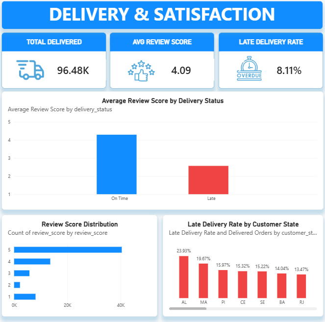

    # Olist E-Commerce Sales Performance Analysis

    > Analisis performa penjualan e-commerce menggunakan **PostgreSQL, SQL, Power BI, dan DAX** untuk memantau revenue, order performance, kategori produk, dan distribusi penjualan berdasarkan wilayah.

    ---


## Project Overview

    ## Project Overview


    Proyek ini menggunakan **Brazilian E-Commerce Public Dataset by Olist**, yang mencakup sekitar **99 ribu orders pada periode 2016–2018**.

    Fokus proyek adalah membuat analisis penjualan yang ringkas dan dashboard **Executive Overview** untuk menjawab pertanyaan bisnis dasar: bagaimana performa penjualan, bagaimana tren revenue berubah dari waktu ke waktu, dan kategori produk serta wilayah mana yang memberikan kontribusi revenue terbesar.


* Revenue dan order performance
* Customer retention dan purchase frequency
* Customer revenue concentration
* Product category performance
* Seller performance
* Delivery performance
* Customer satisfaction
* Geographic delivery performance

    Alur kerja proyek mencakup data validation dan preparation menggunakan PostgreSQL, analisis bisnis menggunakan SQL, serta pembuatan dashboard menggunakan Power BI dan DAX.

    ## Business Context

    Bisnis e-commerce perlu memantau indikator penjualan secara konsisten untuk memahami perkembangan revenue, jumlah pesanan, dan kontribusi kategori produk. Data transaksi yang tersebar di beberapa tabel perlu diolah dan dirangkum agar dapat digunakan untuk mengevaluasi performa bisnis.


## Pertanyaan Bisnis

    Dalam proyek ini, saya berperan sebagai Data Analyst yang menggunakan data transaksi historis Olist untuk menyusun ringkasan performa penjualan dalam satu dashboard.


    ## Problem Statement

    Data transaksi yang tersimpan dalam beberapa tabel tidak langsung memberikan gambaran performa penjualan secara menyeluruh. Diperlukan proses validasi, penggabungan, dan agregasi data untuk menghasilkan metrik yang konsisten serta visualisasi yang mudah dipahami.

    ## Objectives

## Dataset
    - Mengukur indikator utama penjualan: product revenue, orders, customers, dan Average Order Value (AOV).
    - Memantau tren revenue bulanan.
    - Mengidentifikasi kategori produk dengan kontribusi revenue dan volume order tertinggi.
    - Membandingkan revenue berdasarkan state pelanggan.
    - Menyajikan hasil analisis melalui dashboard Power BI yang ringkas dan interaktif.


    ## Business Questions

    1. Berapa total product revenue, jumlah orders, jumlah customers, dan Average Order Value?
    2. Bagaimana tren revenue bulanan sepanjang periode data?
    3. Kategori produk mana yang menghasilkan revenue tertinggi?
    4. Apakah kategori dengan order volume tertinggi juga memiliki revenue tertinggi?
    5. Bagaimana kontribusi revenue berbeda berdasarkan state pelanggan?

    ## Dataset

    **Dataset:** [Brazilian E-Commerce Public Dataset by Olist](https://www.kaggle.com/datasets/olistbr/brazilian-ecommerce)

    Dataset mencakup data customer, orders, order items, products, sellers, payments, reviews, serta pemetaan nama kategori produk dari bahasa Portugis ke bahasa Inggris.

    ### Main Tables

    | Table | Purpose |
    | --- | --- |
    | `customers` | Informasi pelanggan dan lokasi |
    | `orders` | Informasi pesanan dan timestamp |
    | `order_items` | Produk, harga, freight, dan seller pada setiap pesanan |
    | `products` | Informasi produk dan kategori |
    | `product_category_name_translation` | Pemetaan kategori Portugis ke bahasa Inggris |

    Tabel lain pada dataset dapat digunakan bila dibutuhkan, tetapi analisis utama proyek ini berfokus pada metrik penjualan dan kategori produk.

    ### Data Grain Consideration

    Tabel `orders` dan `order_items` memiliki hubungan **one-to-many**: satu order dapat memiliki beberapa item. Karena itu, saat menghitung jumlah order setelah menggabungkan tabel, digunakan:

    ```sql
    COUNT(DISTINCT order_id)
    ```

    Pendekatan ini membantu mencegah penghitungan order yang sama lebih dari satu kali. Revenue produk dihitung pada grain item dari kolom `order_items.price`.

    ## Data Preparation & Validation

    Data preparation dan validation dilakukan menggunakan PostgreSQL.

    ### Timestamp Handling


## Data Preparation & Validation

    Sebagian timestamp awalnya tersimpan sebagai text dan dapat mengandung empty string. Nilai kosong ditangani sebelum konversi ke timestamp, misalnya:

    ```sql
    NULLIF(column_name, '')::TIMESTAMP
    ```

    Nilai yang tidak tersedia dipertahankan sebagai `NULL` jika memang tidak ada tanggal yang tercatat.

    ### Category Mapping

    Nama kategori bahasa Inggris berada di tabel `product_category_name_translation`, bukan langsung di tabel `products`. Penggabungan kategori dilakukan menggunakan `product_category_name`.

    ```sql
    SELECT
        p.product_id,
        pct.product_category_name_english
    FROM products p
    LEFT JOIN product_category_name_translation pct
        ON NULLIF(TRIM(p.product_category_name), '') =
        pct.product_category_name;
    ```

    Validasi menunjukkan tidak ada duplicate key pada translation table. Sebagian kecil revenue produk tidak dapat dipetakan ke kategori bahasa Inggris; kategori yang tidak terpetakan sebaiknya tetap dipertahankan sebagai `Unknown / Untranslated`, bukan dibuang dari perhitungan revenue total.

    ## Key Metrics

    | Metric | Result / Definition |
    | --- | ---: |
    | Unique Customers | **96,096** |
    | Total Orders | **99,441** |
    | Orders with Items | **98,666** |
    | Product Revenue | **Approximately R$13.60M** |
    | Average Order Value | **R$137.74** |

    ### Metric Definitions

    **Product Revenue**

    Dihitung menggunakan `SUM(order_items.price)`. Nilai `freight_value` tidak termasuk dalam definisi revenue proyek ini.

    **Total Orders**

    Jumlah order unik menggunakan `COUNT(DISTINCT orders.order_id)`.

    **Total Customers**

    Jumlah pelanggan unik menggunakan `customer_unique_id`, bukan sekadar menghitung baris pada tabel customers.

    **Average Order Value (AOV)**

    AOV dihitung sebagai product revenue dibagi jumlah order yang memiliki item:

    ```text
    AOV = Product Revenue / Orders with Items
    ```

    Hasil dashboard: **R$137.74**.

    > Catatan: definisi AOV pada proyek ini menggunakan product revenue dan orders with items. Definisi tersebut perlu dipertahankan secara konsisten saat membandingkan angka antara SQL dan Power BI.

    ## Power BI Dashboard — Executive Overview


## Key Metrics
    


    Dashboard satu halaman ini memberikan ringkasan performa penjualan e-commerce.

    ### KPI Cards

    - **Total Revenue** — total product revenue berdasarkan `order_items.price`.
    - **Total Orders** — jumlah order unik.
    - **Total Customers** — jumlah customer unik.
    - **Average Order Value** — product revenue dibagi orders with items.

    ### Visualizations

    - **Monthly Revenue Trend** — memantau perubahan revenue per bulan.
    - **Revenue by Product Category** — membandingkan kontribusi revenue antar kategori.
    - **Revenue by State** — membandingkan revenue berdasarkan state pelanggan.

    ### Dashboard Objective

    > Bagaimana performa penjualan secara keseluruhan, bagaimana trennya berubah dari waktu ke waktu, dan kategori serta wilayah mana yang memberikan kontribusi revenue terbesar?

    ## Key Findings

    ### 1. Revenue Mencapai Puncak pada November 2017

    November 2017 mencatat sekitar **R$1.01 juta** product revenue, dengan **7,451 orders** dan pertumbuhan revenue sekitar **52.10% dibandingkan Oktober 2017**.

    **Business implication:** Periode dengan kenaikan revenue yang signifikan layak ditelusuri lebih lanjut dengan melihat perubahan order volume dan kontribusi kategori produk. Data ini sendiri belum menjelaskan penyebab kenaikan.

# Power BI Dashboard
    ### 2. Kategori dengan Revenue Tertinggi Tidak Selalu Memiliki Order Terbanyak

    Contoh kategori dengan kontribusi revenue tinggi:

    | Product Category | Orders | Approx. Revenue |
    | --- | ---: | ---: |
    | `health_beauty` | 8,836 | R$1.259M |
    | `watches_gifts` | 5,624 | R$1.205M |
    | `bed_bath_table` | 9,417 | R$1.037M |
    | `sports_leisure` | 7,720 | R$988K |
    | `computers_accessories` | 6,689 | R$912K |

    `health_beauty` mencatat revenue tertinggi di antara kategori yang ditampilkan, sedangkan `bed_bath_table` memiliki jumlah order tertinggi di antara kategori tersebut.

    **Business implication:** Kategori produk sebaiknya dievaluasi berdasarkan revenue dan order volume secara bersamaan. Revenue tinggi tidak otomatis berarti profitabilitas tinggi karena dataset ini tidak menyediakan data biaya yang memadai.

    ### 3. Dashboard Mendukung Pemantauan Penjualan dari Beberapa Perspektif

    KPI cards memberikan ringkasan performa, sementara tren bulanan, kategori produk, dan state membantu pengguna menelusuri perubahan serta perbedaan kontribusi penjualan.

    **Business implication:** Dashboard dapat digunakan sebagai titik awal untuk memonitor performa dan mengidentifikasi area yang membutuhkan analisis lebih lanjut.

    ## Recommendations

    Berdasarkan analisis deskriptif ini, beberapa tindak lanjut yang dapat dipertimbangkan adalah:

    1. **Investigasi tren revenue:** telusuri periode dengan kenaikan atau penurunan signifikan menggunakan order volume dan kategori produk.
    2. **Evaluasi kategori produk:** bandingkan revenue dan jumlah order untuk memahami perbedaan kontribusi antar kategori.
    3. **Pantau kontribusi wilayah:** gunakan revenue by state untuk mengidentifikasi perbedaan pola penjualan geografis.
    4. **Kembangkan analisis lanjutan bila diperlukan:** misalnya analisis customer atau delivery dapat menjadi proyek terpisah jika ada kebutuhan bisnis dan ruang lingkup yang jelas.

    Rekomendasi di atas merupakan area untuk investigasi lebih lanjut, bukan klaim bahwa suatu tindakan pasti meningkatkan revenue.

    ## Tools & Technologies

    | Technology | Purpose |
    | --- | --- |
    | **PostgreSQL** | Penyimpanan, validasi, dan persiapan data |
    | **SQL** | Penggabungan tabel, agregasi, dan analisis bisnis |
    | **Power BI** | Dashboard dan visualisasi interaktif |
    | **DAX** | Perhitungan KPI dan measures |
    | **Git & GitHub** | Version control dan dokumentasi proyek |

    ## Project Structure

    Sesuaikan struktur di bawah ini dengan file yang benar-benar diunggah ke repository.

    ```text
    olist-ecommerce-sales-performance/
    ├── README.md
    ├── sql/
    │   ├── 01_data_validation.sql
    │   ├── 02_data_cleaning.sql
    │   └── 03_sales_analysis.sql
    ├── powerbi/
    │   └── Olist_Sales_Performance.pbix
    ├── images/
    │   └── executive_overview.png
    └── data/
        └── README.md
    ```

    Jangan mengunggah dataset mentah berukuran besar jika tidak diperlukan. Cukup sertakan tautan sumber dataset dan petunjuk untuk mendapatkannya.

    ## Limitations

    - **Historical data:** dataset mencakup sekitar 2016–2018 dan tidak merepresentasikan kondisi e-commerce saat ini.
    - **Revenue definition:** revenue hanya menggunakan `order_items.price` dan tidak mencakup `freight_value`.
    - **No cost data:** analisis ini tidak dapat menentukan profit atau profit margin.
    - **Category mapping:** sebagian kecil revenue tidak memiliki kategori bahasa Inggris yang dapat dipetakan.
    - **Descriptive analysis:** hasil menunjukkan pola pada data historis dan tidak membuktikan penyebab dari perubahan revenue.

    ## Author

    **Fathur Rahman Rifaldi**  
    Information Systems Student | Aspiring Data Analyst

    - [LinkedIn](https://linkedin.com/in/fathurrahmanrifaldi/)
    - [GitHub](https://github.com/fathurrahmanrifaldi)
    - [Portfolio](https://fathurrahmanrifaldi.vercel.app)

    ## Disclaimer



Halaman **Delivery & Satisfaction** menganalisis logistics performance dan customer experience.

### KPIs

* Total Delivered
* Late Delivery Rate
* Average Review Score

### Visualizations

* Review Score by Delivery Status
* Review Score Distribution
* Late Delivery Rate by State

### Business Question

> **Bagaimana delivery performance berkaitan dengan customer satisfaction?**

---

# Key Findings

## 1. Revenue Mengalami Pertumbuhan yang Kuat Selama 2017

Monthly revenue mengalami peningkatan yang cukup besar sepanjang tahun 2017.

**November 2017** mencatat sekitar:

> ### R$1.01M

dengan:

* **7,451 orders**
* Sekitar **52.10% month-over-month revenue growth** dibandingkan Oktober 2017

Revenue kemudian mengalami fluktuasi selama 2018, tetapi tetap berada pada level yang relatif tinggi hingga Agustus.

---

## 2. Repeat Customers Merupakan Sebagian Kecil dari Customer Base

Hanya:

> ### 3.12%

dari unique customers yang diklasifikasikan sebagai repeat customers.

Namun, repeat customers menghasilkan revenue per customer yang lebih tinggi:

| Customer Type | Customers | Revenue / Customer |
| ------------- | --------: | -----------------: |
| One-Time      |    93,099 |           R$137.66 |
| Repeat        |     2,997 |           R$259.87 |

Hal ini menunjukkan bahwa **customer purchase frequency merupakan salah satu dimensi penting untuk analisis customer lebih lanjut**.

---

## 3. Revenue Terkonsentrasi pada High-Value Customers

Top **10% of customers**, berdasarkan product revenue, memberikan kontribusi:

> ### 41.23% of Total Product Revenue

Hal ini menunjukkan bahwa kontribusi revenue tidak tersebar secara merata di seluruh customer base.

**Important:** Analisis ini mengukur revenue contribution dan tidak boleh diinterpretasikan secara langsung sebagai ukuran customer loyalty.

---

## 4. Category Performance Berbeda antara Order Volume dan Revenue

Order volume tidak selalu secara langsung mencerminkan revenue contribution.

| Category                | Orders |  Revenue |
| ----------------------- | -----: | -------: |
| `health_beauty`         |  8,836 | R$1.259M |
| `watches_gifts`         |  5,624 | R$1.205M |
| `bed_bath_table`        |  9,417 | R$1.037M |
| `sports_leisure`        |  7,720 |   R$988K |
| `computers_accessories` |  6,689 |   R$912K |

Sebagai contoh, `bed_bath_table` menghasilkan order yang lebih banyak dibandingkan `health_beauty`, sedangkan `health_beauty` menghasilkan product revenue yang lebih tinggi.

Hal ini menunjukkan bahwa category performance sebaiknya dievaluasi menggunakan **transaction volume dan monetary contribution secara bersamaan**.

---

## 5. Late Delivery Rate Sebesar 8.11% di antara Delivered Orders

Secara keseluruhan, delivery performance adalah:

| Status        | Orders |  Share |
| ------------- | -----: | -----: |
| On Time       | 88,649 | 89.15% |
| Late          |  7,827 |  7.87% |

Late delivery rate di antara **delivered orders** adalah:

> ### 8.11%

---

## 6. Late Deliveries Berkaitan dengan Review Scores yang Lebih Rendah

Average review scores berbeda antara late dan on-time deliveries:

| Delivery Status | Reviewed Orders | Average Review |
| --------------- | --------------: | -------------: |
| Late            |           5,395 |           2.57 |
| On Time         |          62,371 |           4.29 |

Perbedaannya adalah:

> ### 1.72 Review Points

Hal ini menunjukkan adanya **association antara delivery status dan customer review scores** pada data yang diamati.

>  **Important:** Analisis ini **tidak membuktikan hubungan kausalitas**. Hubungan yang diamati tidak membuktikan bahwa late delivery secara langsung menyebabkan review scores yang lebih rendah.

---

## 7. Delivery Performance Berbeda di Berbagai States

Late delivery rates menunjukkan variasi yang cukup besar di berbagai Brazilian states.

| State | Delivered Orders | Late Orders | Late Rate |
| ----- | ---------------: | ----------: | --------: |
| CE    |            1,279 |         196 |    15.32% |
| BA    |            3,256 |         457 |    14.04% |
| RJ    |           12,353 |       1,664 |    13.47% |
| SP    |           40,495 |       2,387 |     5.89% |
| MG    |           11,355 |         638 |     5.62% |
| PR    |            4,923 |         246 |     5.00% |

Baik **delivery rate maupun order volume** perlu dipertimbangkan ketika menginterpretasikan geographic delivery performance.

---

# Potential Business Actions

Pola yang ditemukan menunjukkan beberapa area yang dapat dianalisis lebih lanjut.

### 1. Customer Retention

Customer dapat disegmentasikan lebih lanjut berdasarkan:

* Purchase frequency
* Revenue
* Recency
* Category preference

Hal ini dapat mendukung analisis retention dan engagement yang lebih targeted.

### 2. High-Value Customer Analysis

High-revenue customers dapat dimonitor berdasarkan:

* Revenue contribution
* Purchase frequency
* Category preference
* Changes in purchasing behavior

### 3. Category Strategy

Kategori dapat dievaluasi menggunakan beberapa dimensi:

* Order volume
* Revenue
* Revenue share
* Revenue per order

### 4. Delivery Performance

Late delivery patterns dapat dianalisis lebih lanjut berdasarkan:

* State
* Seller
* Order characteristics
* Delivery duration

### 5. Customer Experience

Delivery KPIs dapat dikombinasikan dengan review metrics untuk memonitor potential relationships antara **logistics performance dan customer satisfaction**.

---

# Limitations

Beberapa keterbatasan perlu dipertimbangkan ketika menginterpretasikan hasil analisis.

### Historical Dataset

Dataset mencakup periode sekitar **2016–2018**, sehingga tidak merepresentasikan kondisi e-commerce saat ini.

### Revenue Definition

Revenue dihitung menggunakan:

```text
order_items.price
```

dan tidak mencakup:

```text
freight_value
```

### No Cost Data

Dataset tidak menyediakan informasi biaya yang memadai untuk menghitung:

* Profit
* Profit margin

Oleh karena itu, kategori atau seller dengan revenue tinggi **tidak dapat secara otomatis diinterpretasikan sebagai kategori atau seller yang paling profitable**.

### Review Data

Review analysis hanya mencakup order yang memiliki available reviews.

Oleh karena itu, hasil analisis review mungkin tidak merepresentasikan seluruh order.

### Correlation vs. Causation

Hubungan antara delivery status dan review score harus diinterpretasikan sebagai **association**, bukan sebagai bukti bahwa late delivery secara langsung menyebabkan review yang lebih rendah.

### Category Mapping

Sebagian kecil product revenue tidak dapat dipetakan ke English product category dan diklasifikasikan sebagai:

```text
Unknown / Untranslated
```

---

# Tools & Technologies

| Technology       | Purpose                                              |
| ---------------- | ---------------------------------------------------- |
| **PostgreSQL**   | Data storage, cleaning, validation, dan SQL analysis |
| **SQL**          | Business analysis dan data transformation            |
| **Power BI**     | Interactive dashboard dan data visualization         |
| **DAX**          | Business metrics dan calculated measures             |
| **Git & GitHub** | Version control dan project documentation            |

---

# Project Structure

```text
olist-ecommerce-business-analytics/
│
├── README.md
│
├── sql/
│   ├── 01_data_validation.sql
│   ├── 02_data_cleaning.sql
│   ├── 03_business_analysis.sql
│   └── 04_advanced_analysis.sql
│
├── powerbi/
│   └── Olist_Ecommerce_Analytics.pbix
│
├── images/
│   ├── executive_overview.png
│   ├── customer_analytics.png
│   └── delivery_satisfaction.png
│
└── data/
    └── README.md
```

---

# Future Improvements

Pengembangan lebih lanjut yang dapat dilakukan pada proyek ini meliputi:

* Customer RFM segmentation
* Customer cohort analysis
* Customer lifetime value analysis
* Seller performance segmentation
* Delivery time analysis
* Category-level customer segmentation
* Pareto analysis of revenue contribution
* Statistical analysis of delivery and review scores
* Predictive modeling for repeat purchases
* Predictive delivery delay analysis

---

# Author

**Fathur Rahman Rifaldi**

Information Systems Student

Interested in:

* Data Analytics
* Business Intelligence
* Machine Learning
* Information Systems

---

## Disclaimer
    Proyek ini dibuat untuk tujuan pembelajaran dan portofolio. Insight dan rekomendasi merupakan interpretasi deskriptif dari dataset publik historis, bukan klaim tentang hasil operasional aktual atau hubungan sebab-akibat.
